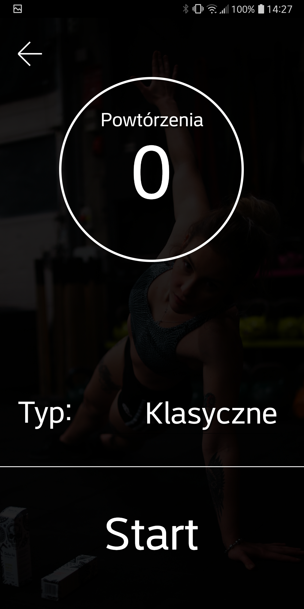
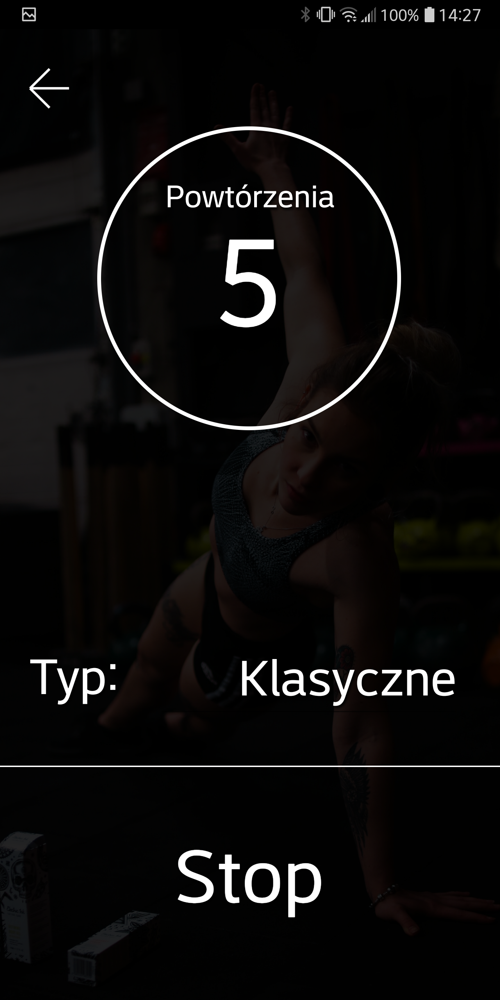
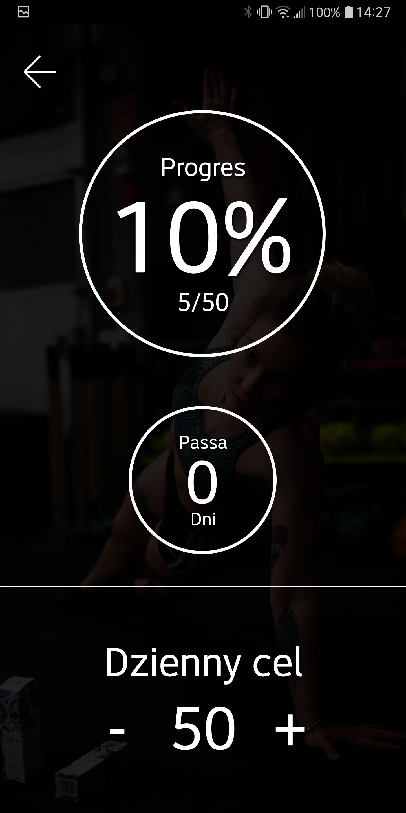
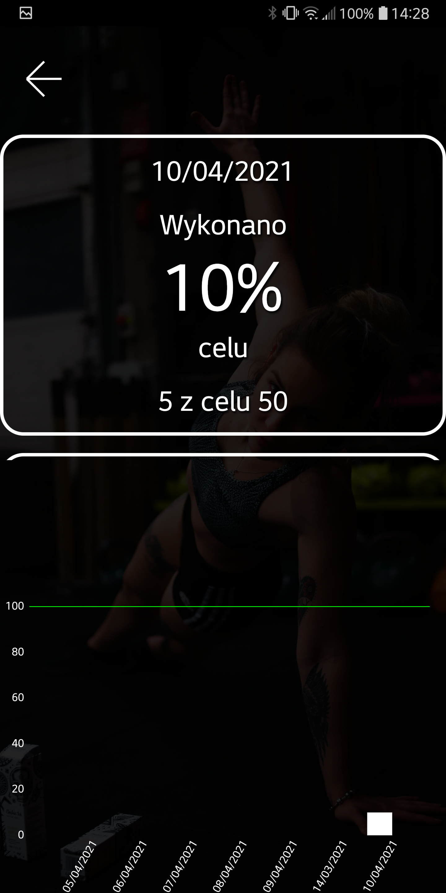

# PushUps Android application
This is an app for registering your push ups workouts. 
For this app to work, you need to put your phone under your chest while doing push ups.
Then push ups are automaticaly detected by using proximity sensor.

### Home screen

### Before workout

### During workout

### Setting up your daily goal

### Your push ups history

